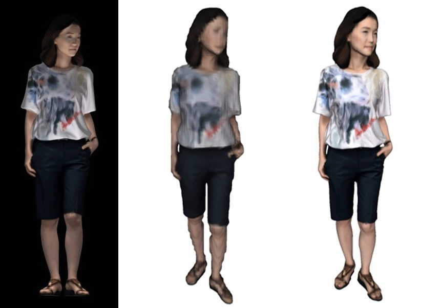
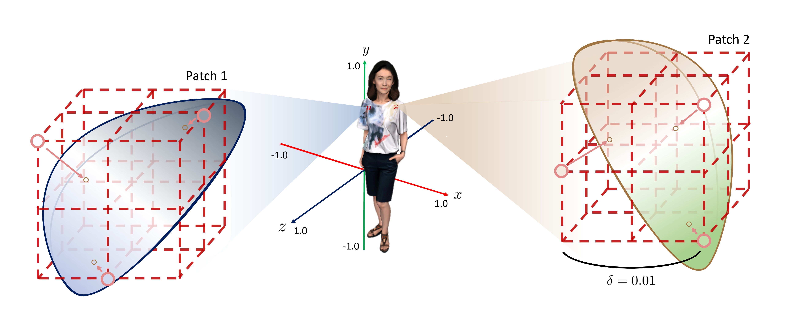
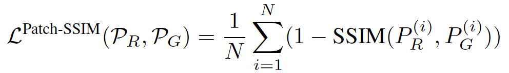
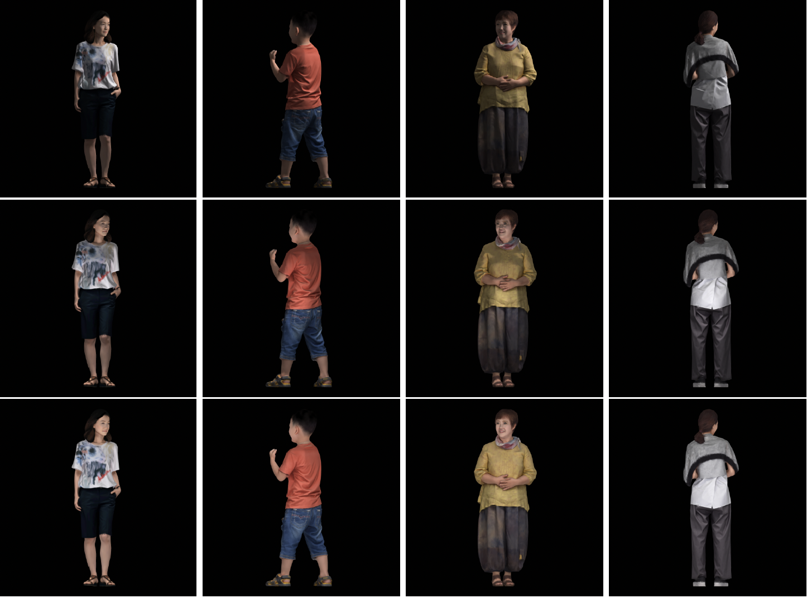
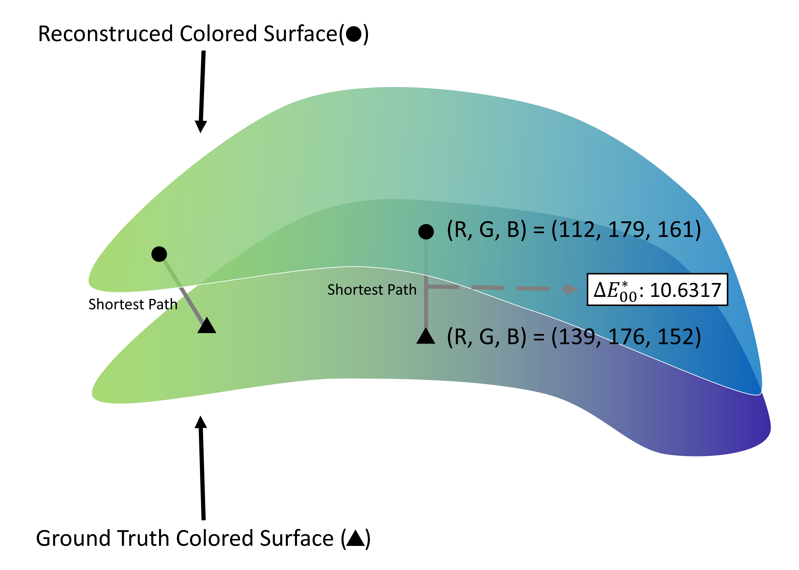
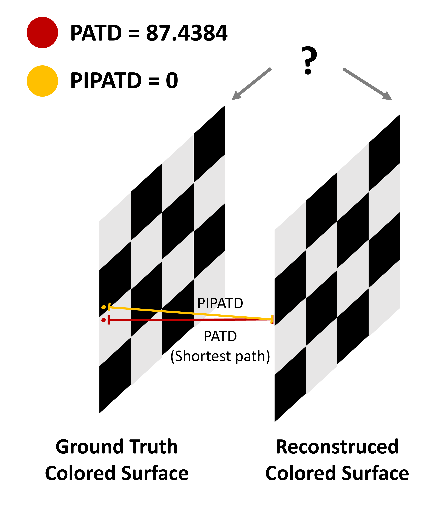

# Avatar Texture Enhancement via 3D Patch-wise SSIM Loss

## Abstract

This project originated from [PIFu: Pixel-Aligned Implicit Function for High-Resolution Clothed Human Digitization](https://github.com/shunsukesaito/PIFu).

Main contributions:
- **Texture Enhancement**:  
  Proposed a novel training strategy to improve the reconstruction of avatar textures.  

- **Novel Evaluation Metric**:  
  Introduced new texture evaluation metrics, namely Perception Aware Texture Distance (PATD) and Perturbation Insensitive PATD (PIPATD), to address the absence of quantitative evaluation for texture reconstruction.

## Introduction

[PIFu: Pixel-Aligned Implicit Function for High-Resolution Clothed Human Digitization](https://github.com/shunsukesaito/PIFu) introduced occupancy field in human shape reconstruction. It is significant for its ability to reconstruct intricate structures such as wrinkles and hair that are challenging to restore. However, in the case of wild images, phenomena like shadows or intense sunlight can cause the person in the photo to appear darker or brighter than in reality. When such images are used as input, models trained on synthetic data tend to restore textures that are darker or brighter than reality.

 

  

  
    From left to right: Wild input, PIfu-inferenced, Ground Truth (GT) meshes
  

This study aims to propose a 3D human reconstruction methodology capable of restoring accurate albedo colors from wild images. Augmented wild image pairs, created by varying lighting conditions, will be used to fine-tune a pre-trained PIFu model. The novel approach involves utilizing 3D patch-wise SSIM loss for training, offering advantages over traditional point-wise L1 loss by capturing local texture features and incorporating edge distance due to contrast.

The performance improvement will be assessed by comparing and evaluating models trained with these two types of loss. Finally, to address the lack of quantitative evaluation criteria for restored textures in traditional PIFu, we propose new metrics: Perception Aware Texture Distance (PATD) and Perturbation Insensitive PATD (PIPATD).

## Method

### 3D Patch-wise SSIM Loss

  

In this study, we propose using 3D patches sampled in space as inputs for SSIM. The SSIM loss for patches, where $P_R$ consists of patches composed of reconstructed colors, and $P_G$ consists of patches composed of ground truth mesh colors, is defined as follows:

   

In spatial contexts, the colors of neighboring points exhibit strong dependencies, providing crucial information about the structure of visual objects. The limitation of Point-wise loss lies in its inability to adequately capture these dependencies. Even if Point-wise loss yields outputs with identical values, there may be qualitative differences when observed by the human eye. To address this, we leverage the correlations among closely positioned colors in space by sampling points on a patch-by-patch basis. Furthermore, we propose a 3D patch-wise loss designed based on the structural dependencies of points within a patch, making it suitable for application in image-based 3D avatar reconstruction.

The conventional use of L1 loss in texture learning for PIFu offers significant computational advantages. However, it falls short in leveraging information about the image structure derived from the color distribution among adjacent vertices. Moreover, despite a wild input image sharing the same color tones as the ground-truth image, variations in RGB values due to lighting conditions can be substantial. In other words, utilizing L1 loss based solely on RGB values makes it challenging to capture the strong correlations among colors of adjacent points on the GT surface.

On the contrary, SSIM loss, resembling the human visual system (HVS), calculates similarity based on three elements: luminance, contrast, and structure. This makes SSIM loss more suitable for handling color variations caused by lighting conditions in localized areas of wild images, as mentioned earlier. Additionally, by computing SSIM indices among points sampled in patches, we can concentrate on the local features present in the entire color field. This allows for a more nuanced understanding of the color relationships among

## Dataset

For fine-tuning, the training dataset utilizes the [2K2K](https://github.com/SangHunHan(2)/2K2K) dataset. Rendered images corresponding to each human mesh in 2K2K are computed using the rendering pipeline from the pytorch3D library. To obtain diverse wild images, augmentation is performed by varying the position of the light source, as well as the intensity of ambient and diffuse light. The light source positions and the intensity of ambient and diffuse light are randomly selected but constrained to obatain diverse lighting conditions. For each ground truth mesh, we generated 135 rendered images by applying three augmentations at 45 different angles with an 8° interval in the horizontal direction.

  

  
    Rendered images after augmentation
  

## Evaluation
### Perception Aware Texture Distance (PATD)

The error in the color $f_{C,R}(X)$ of the reconstructed surface can be categorized into two types of discrepancies. The first type originates from inaccuracies in the reconstruction of surface points $X$, which are derived from errors in the ground truth surface $X^\ast$ and the closest matching point $X^\ast$ on the reconstructed surface. This error can be adjusted by comparing $f_{C,R}(X)$ and $f_{C,G}(X^*)$. Particularly, PATD is effective in cases where there are local bumps or irregularities in one of the surfaces, as it disregards surface mis-reconstruction and focuses solely on the differences in texture. Thus, we propose Perception Aware Texture Distance (PATD), which measures the distance between two colored vertices, as illustrated in Figure.

$$\textnormal{PATD}(V_R, V_G) := \dfrac{1}{|V_R|} \sum_{X_i \in V_R} d_{\textnormal{color}}(f_{C, R}(X_i), f_{C, G}(\underset{X_i^* \in V_G}{\textnormal{argmin}} \|X_i - X_i^*\|_2))$$

At this point, $d_{color}$ represents the color distance in the RGB space, considering the human perceptual system. In this study, we employ the widely used CIEDE2000 as the representative metric for this distance.

$$d_{color} = \sqrt{\left(\frac{\Delta L'}{k_{L}S_{L}}\right)^{2} +
  \left(\frac{\Delta C'}{k_{C}S_{C}}\right)^{2} +
  \left(\frac{\Delta H'}{k_{H}S_{H}}\right)^{2} +
  R_{T}\frac{\Delta C'}{k_{C}S_{C}}\frac{\Delta H'}{k_{H}S_{H}}
}$$

PATD is expected to demonstrate good efficiency in cases of localized distortion in surface reconstruction. In PATD, for each point on the reconstructed surface, we select the point on the ground truth surface with the shortest distance and compare their colors. This is because quantitatively comparing the color fields of the ground truth and reconstructed surfaces is challenging due to the distinct domains of the ground truth surface and reconstructed surface.

  

In situations where comparing the color fields between two surfaces becomes challenging, for example, when the color fields of both surfaces have different domains originating from the ground truth surface and the reconstructed surface, one could consider augmenting the color of points on both surfaces and designing a cost function that is proportional to the color. This could lead to considering Wasserstein distance or Gromov-Wasserstein distance between the two surfaces. However, this approach poses computational challenges and lacks intuitiveness.

Therefore, we aim to intuitively control errors caused by surface mis-reconstruction by making the domains of the two color fields identical. In this scenario, given that the ground truth surface is the actual domain of the color field, we contemplate embedding the color field present on the reconstructed surface appropriately into the ground truth surface. If the ground truth surface is a smooth 2-manifold, the reconstructed surface adopts it at an average level with added errors, forming a 3D space composed of sampled points. This implies that the intrinsic dimension of the vertices on the reconstructed surface is 2, and the manifold from which the distribution originates is the ground truth surface. Therefore, by utilizing techniques from nonlinear dimensionality reduction (manifold learning) to appropriately embed the domain of the reconstructed color field into the ground truth surface, it is anticipated that we can compare color fields while preserving spatial information inherent in the reconstructed surface.

### Perturbation Insensitive PATD (PIPATD)

In cases where there is a slight shift or perturbation in the color field, PATD can yield significantly large values, even when the visual appearance seems very similar. This highlights a limitation in PATD, designed to consider human perception, and calls for a complementary approach. To address this, we propose Perturbation Insensitive PATD (PIPATD), which aims to disregard slight perturbations in the color field and provide a more robust assessment.

$$\textnormal{PIPATD}(V_R, V_G) := \dfrac{1}{|V_R|} \sum_{X_i \in V_R} \min_{X_i^* \in \textnormal{NN}(X_i, V_G, k)}d_{\textnormal{color}}(f_{C, R}(X_i), f_{C, G}(X_i^*))$$

Here, $k$ is a hyperparameter determining how many nearest neighbors of $X_i$ to consider when calculating PATD, denoted as $NN(X_i, V_G, k) ⊂ V_G$, representing a set of vertices in $V_G$ with $k$ nearest neighbors based on $X_i$. In this context, even with slight perturbations, if among the $k$ nearest ground truth vertices to the reconstructed vertex, there exists a vertex with similar color to the corresponding vertex, only the distance between them is utilized. This approach ensures that small shifts are not overly sensitive in comparing color fields, effectively reflecting the human perceptual system.

  

## Results

### Qualitative Results

In Figure (a), observing the shoes of the boy in the ground truth 3D avatar, a distinct red brand logo is clearly visible. However, in the 3D avatars reconstructed by baseline PIFu or PIFu fine-tuned with L1 loss, this logo appears blurry and challenging to distinguish from the other black parts of the shoes. In contrast, when fine-tuned with patch-wise SSIM loss, the PIFu model restores the logo in a shape and color similar to that of the ground truth 3D avatar. Additionally, logos, wrinkles, and camouflage patterns on the green clothing worn by the boy are better restored with patch-wise SSIM loss compared to L1 loss. This indicates that using SSIM allows the predicted 3D avatar to exhibit local properties and structural similarity similar to the ground truth 3D avatar. In contrast, using point-wise L1 loss tends to follow the dominant colors of the surface, leading to patterns in places where surface colors dominate.

  

In Figure (b), the pattern on the red clothing worn by the woman is also more accurately restored when using patch-wise SSIM loss. Particularly, looking at the sleeve part of the woman's right hand, when fine-tuned with L1 loss, the color gradually transitions from red to apricot on the sleeve, while using patch-wise SSIM loss clearly distinguishes the sleeve part from the hand part. This implies that even with dark or blurry images introduced through augmentation, fine-tuning with SSIM loss enables better recognition of the original edges of the 3D avatar. In Figure (c), when using L1 loss, the white headband worn by the girl appears blurry against the black hair, whereas when fine-tuned with patch-wise SSIM loss, the PIFu model reconstructs the headband well. The black leopard pattern on the white skirt worn by the girl is also clearer when using patch-wise SSIM loss compared to L1 loss.

### Quantitative Results

| Metric            | Augmentation | Baseline PIFu | Fine-tuned PIFu (L1 Loss) | Fine-tuned PIFu (3D Patch-wise SSIM Loss) |
|-------------------|--------------------|---------------|-----------------------------|----------------------------------------|
| PATD              | Wild                 | 18.78           | **10.32**                       | 10.33                                   |
|                   | Intermediate                  | 16.33         | 9.78                     | **9.56**                                 |
|                   | Clear                | 13.26           | 9.16                      | **9.12**                               |
| PIPATD            | Wild                 | 16.09           | 8.17                         | **8.15**                                 |
|                   | Intermediate                  | 13.73           | 7.60                         | **7.43**                                    |
|                   | Clear                | 10.79           | 7.07                         | **7.01**                                  |

As observed in Table, the fine-tuned PIFu consistently demonstrated significant improvements in both PATD and PIPATD values across all levels of augmentation compared to the baseline PIFu. Notably, the fine-tuned PIFu models effectively mitigated the variability in PATD and PIPATD values across different augmentation strengths, a phenomenon more pronounced in the baseline PIFu. While there was no substantial difference noted between fine-tuning with L1 loss and patch-wise SSIM loss, the latter showed a slight advantage in most augmentation strengths. Particularly, for intermediate augmentation, patch-wise SSIM loss displayed effective performance improvement over L1 loss in both PATD and PIPATD.